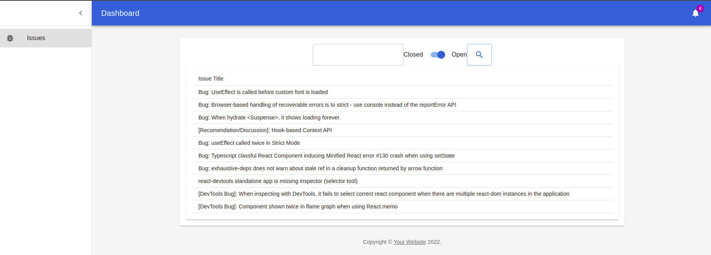

# React Js (WEB)

## Browsers support

| [](http://godban.github.io/browsers-support-badges/)<br/>IE / Edge | [](http://godban.github.io/browsers-support-badges/)<br/>Firefox | [](http://godban.github.io/browsers-support-badges/)<br/>Chrome | [](http://godban.github.io/browsers-support-badges/)<br/>Safari | [](http://godban.github.io/browsers-support-badges/)<br/>iOS Safari | [](http://godban.github.io/browsers-support-badges/)<br/>Samsung | [](http://godban.github.io/browsers-support-badges/)<br/>Opera |
| --------- | --------- | --------- | --------- | --------- | --------- | --------- |
| IE11, Edge| last 2 versions| last 2 versions| last 2 versions| last 2 versions| last 2 versions| last 2 versions


## Demo



Content:

- [Installation](#installation)
- [Usage](#usage)

<!-- GETTING STARTED -->
## Getting Started

### Prerequisites

You must to have installed node and yarn

### Installation

1. Clone the repo
   ```sh
   git clone https://github.com/your_username_/Project-Name.git
   ```
2. Install NPM packages
   ```sh
   yarn
   ```
3. Get token from github.
4. Add your token in the `.env` file
   ```js
    REACT_APP_GRAPHQL_URL=https://api.github.com/graphql
    REACT_APP_GITHUB_TOKEN=[YOUR_TOKEN]
   ```

<p align="right">(<a href="#top">back to top</a>)</p>

<!-- USAGE EXAMPLES -->
## Usage

The default port it's 8080, and the main page it's at http://localhost:8080/issues

<p align="right">(<a href="#top">back to top</a>)</p>
